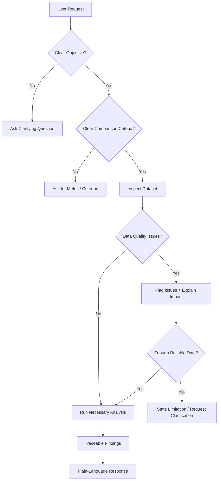

# 📊 Data Analysis Assistant GPT

### Responsible • Traceable • Plain-Language Data Analysis

[](https://chatgpt.com/g/g-6ab8a393af6881919d925e73dd5538a0-data-analysis-assistant)
[](https://www.loom.com/share/a67d31423a9c434891bcb540e3deb704)
[](Topic_13_Data_Analysis_Assistant_GPT_Assessment.pdf)


> A portfolio-ready Custom GPT for responsible business data analysis, built for non-technical stakeholders.

---

## 🧭 What This Project Does

This Custom GPT analyzes structured business datasets using **Code Interpreter & Data Analysis**, while enforcing explicit governance and anti-fabrication rules.

It is designed to:

- Explain findings in plain language
- Use analysis tools only when genuinely necessary
- Ask clarifying questions when the objective is missing
- Ask for a metric when a comparison is ambiguous
- Detect missing, duplicate, invalid, or suspicious data
- Avoid unsupported assumptions and fabricated conclusions
- Disclose important limitations

---

## ✨ Core Capabilities

| Capability | Implementation |
|---|---|
| 🔎 Data analysis | Code Interpreter & Data Analysis |
| 🧠 Objective handling | Mandatory Objective Gate |
| 📋 Data quality | Missing, duplicate, invalid & suspicious-value checks |
| 🛡️ Anti-fabrication | Dataset-grounded conclusions |
| 💬 Communication | Plain language |
| ❓ Ambiguity handling | Metric/criteria clarification |
| ✅ Validation | 4 required scenarios — 4/4 passed |

---

## 🧩 Decision Flow



---

## 🛡️ Responsible Analysis Guardrails

### Objective Gate
If the user asks to analyze a dataset without specifying what they want analyzed, the GPT **does not choose an objective**. It asks for clarification first.

### Ambiguous Comparison Gate
If the user asks which region/item is “better,” “best,” “strongest,” “worst,” or asks for a ranking without specifying the metric, the GPT **does not choose the metric**. It asks the user to define the criterion.

### Anti-Fabrication
The GPT is instructed to:

- Never fabricate data or calculations
- Never invent missing values
- Never silently correct incorrect data
- Never claim analysis was performed when it was not
- State limitations when data is insufficient

---

## 🧪 Validation — 4/4 PASS ✅

| Test | Scenario | Expected Behavior | Result |
|---:|---|---|:---:|
| 01 | Clear objective | Analyze and explain findings | ✅ PASS |
| 02 | No objective | Ask what to analyze | ✅ PASS |
| 03 | Incomplete / incorrect data | Flag issues and impact | ✅ PASS |
| 04 | Ambiguous comparison | Ask for evaluation metric | ✅ PASS |

### Test 01 — Clear Objective

The GPT analyzed the uploaded 9-record sales dataset, calculated metrics, identified monthly/product/regional patterns, explained the findings in plain language, and disclosed the small-sample limitation.

### Test 02 — No Objective

For **“Analyze the uploaded dataset.”**, the GPT asked what the user wanted to analyze instead of selecting an objective itself.

### Test 03 — Data Quality

The incomplete test dataset contains missing values and a negative `Units_Sold` entry. The GPT flagged the issues, explained their potential impact, and did not silently clean the data.

### Test 04 — Ambiguous Comparison

For **“Compare the performance of the regions and tell me which one is better.”**, the GPT asked which metric should be used instead of selecting one itself.

---

## 📁 Repository Structure

```text
ai-data-analysis-assistant-gpt/
├── 📄 README.md
├── 📄 instruction_block.md
├── 📄 test_results.md
├── 📊 sample_dataset.csv
├── ⚠️ incomplete_dataset.csv
└── 📑 Topic_13_Data_Analysis_Assistant_GPT_Assessment.pdf
```

### File Guide

| File | Purpose |
|---|---|
| `sample_dataset.csv` | Clean sample business sales dataset |
| `incomplete_dataset.csv` | Data-quality challenge dataset |
| `instruction_block.md` | GPT behavior, governance & guardrails |
| `test_results.md` | Evidence for all four required tests |
| Assessment PDF | Consolidated assessment documentation |

---

## 🔬 Test Dataset Design

The data-quality scenario intentionally introduces:

- Missing `Units_Sold`
- Missing `Revenue`
- Negative `Units_Sold`
- A suspicious revenue-to-units combination

The GPT is expected to **flag and explain** these issues rather than silently modify them.

---

## 📝 Challenges & Resolutions

| Challenge | Resolution |
|---|---|
| GPT initially analyzed data without an objective | Added a mandatory Objective Gate |
| GPT initially chose metrics for an ambiguous comparison | Added a Critical Ambiguous Comparison Gate |
| Data-quality problems could distort conclusions | Added explicit quality checks and impact warnings |

---

## 🎥 Demo

The Loom walkthrough demonstrates:

1. GPT configuration
2. Code Interpreter & Data Analysis enabled
3. Knowledge files
4. Clear-objective analysis
5. No-objective clarification
6. Data-quality issue detection
7. Ambiguous-comparison clarification
8. Final 4/4 validation

**[▶ Watch the Loom Demo](https://www.loom.com/share/a67d31423a9c434891bcb540e3deb704)**

---

## ✅ Assessment Checklist

- [x] Code Interpreter & Data Analysis enabled
- [x] Plain-language explanations
- [x] Tool governance
- [x] Anti-fabrication guardrails
- [x] Clear-objective test
- [x] No-objective clarification
- [x] Data-quality test
- [x] Ambiguous-comparison clarification
- [x] Instruction block
- [x] Test results
- [x] Sample datasets
- [x] Loom demonstration
- [x] Assessment PDF

---

## 🔗 Project Links

**Custom GPT:**  
https://chatgpt.com/g/g-6ab8a393af6881919d925e73dd5538a0-data-analysis-assistant

**Loom Demo:**  
https://www.loom.com/share/a67d31423a9c434891bcb540e3deb704

---

<div align="center">

### Built as a Topic 13 Custom GPT Assessment Project

**Responsible analysis • Clear communication • Explicit guardrails • Evidence-based testing**

</div>
